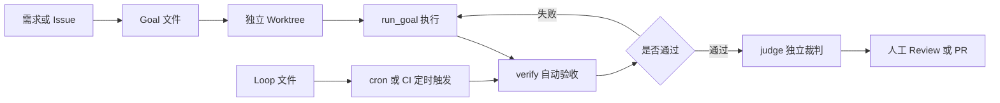

# Agent Harness

本目录是 `job-buddy` 的自动化开发工作流脚手架，遵循 [`AI协作开发与质量验证规范`](../agent-doc/工程规范/AI协作开发与质量验证规范.md) 中的文档即代码、可验证目标和 Harness 优先原则，把“目标定义、隔离执行、自动验证、独立裁判、软着陆报告”固化成可复用的工程动作。

## 项目模块

```text
job-buddy/
├── agent-backend/      # Java Spring Boot 统一后端 / 编排服务
├── agent-runtime/      # Python FastAPI + LangGraph，Agent 运行时与工具体系
├── agent-intent/       # 意图识别与路由模块
├── agent-sandbox/      # Python FastAPI + srt，代码与命令沙箱执行器
├── agent-eval/         # Agent 与模型效果评估服务
├── agent-memory/       # 长程记忆与上下文管理服务
├── agent-tool/         # 公共工具库与工具市场
├── agent-frontend/     # Vue 3 + Vite 前端工程
└── agent-doc/          # 开发理念、设计文档、参考资料
```

`gate.sh` 是代码交付前的统一质量门禁，默认先跑测试/构建，再跑确定性评估；只有门禁退出码为 0 才允许声明任务完成。`verify.sh` 只负责测试/构建层，`evaluate.sh` 负责行为评估层。

`verify.sh` 已按多技术栈设计：

- Flyway 迁移：全量验证和 `agent-backend` 验证会先执行 `check_flyway_migrations.py`，验证 V1.0.0 至 V1.0.7 规范基线、迁移命名、版本唯一性和不可变性；默认账号及角色关联只允许出现在规范初始化数据迁移中，后续迁移禁止向用户私有业务表写入初始化数据。`blacklist_item` 仅允许通过门禁明确登记的 V1.0.8 迁移插入平台级系统黑名单种子，仍禁止更新或删除。
- 部署配置：全量验证会编译检查环境同步脚本、校验 `.env` 键集合，分别渲染 `docker-compose-infra.yml` 与 `docker-compose.yml`，并检查基础设施服务没有混入应用编排、两个 Compose 项目名不会被宿主 `COMPOSE_PROJECT_NAME` 污染。
- `agent-backend`：要求 JDK 17+，优先识别 Maven Wrapper / Maven / Gradle Wrapper / Gradle，执行 `test` 或 `verify/build`。
- `agent-frontend`：识别 `package.json`，执行 `npm ci`、`lint`、`test`、`build`；生产构建在 `--quick` 模式下也不会跳过。
- Python 模块：识别 `pyproject.toml`，执行 `uv sync --frozen`、全量 `ruff check`（规则以各模块 `pyproject.toml` 配置为准）与 `python -m pytest`。

## 工作流总览



核心原则：

- **开发文档优先**：关键改动必须先阅读 `agent-doc` 对应主题目录中的文档；若没有对应文档，必须先创建语义化命名的主题文档，说明为什么做、怎么做、注意什么、如何验证，再进入实现。
- **Harness 优先**：先补测试、lint、类型检查、健康检查和可复现命令，再交给 Agent 实现。
- **目标可判定**：Goal 的完成条件必须能通过命令退出码、测试摘要、diff 或报告证明。
- **预算可控**：每个无人值守任务都必须设置最大轮次、最长时间、修改范围和软着陆条件。
- **执行隔离**：并行任务使用独立 Git worktree 与独立分支，不共享脏工作区。
- **人负责最终质量**：Agent 生成代码和报告，人负责架构判断、风险边界和合并决策。

## 目录结构

```text
.agent-harness/
├── README.md
├── browser-validation.md     # 浏览器端到端验证操作指引
├── goals/
│   ├── _template.md          # /goal 任务模板
│   ├── backend_quality_gate.md  # 后端质量门禁 goal
│   └── harness_smoke.md      # 低风险 smoke goal
├── loops/
│   ├── _template.md          # loop 任务模板
│   └── ci_health.md          # 只读 CI 健康巡检示例
├── runs/                     # 运行产物：日志、summary、verdict、diff，已被 .gitignore 忽略；默认保留 30 天
└── scripts/
    ├── doctor.sh             # 依赖与 harness 自检
    ├── check_flyway_migrations.py  # Flyway 迁移命名、版本唯一与只追加校验
    ├── verify.sh             # 测试/构建层统一验证入口
    ├── evaluate.sh           # 行为评估层入口，包含 Eval YAML/self-check 与前端生命周期回归
    ├── gate.sh               # 交付门禁：verify + evaluate
    ├── run_goal.sh           # /goal 执行器
    ├── judge.sh              # 独立验收裁判
    ├── loop.sh               # cron/CI 友好的 loop 执行器
    ├── new_worktree.sh       # 并行任务隔离工作区
    └── status.sh             # 最近运行状态查看
```

## 第一次使用

先做本地依赖检查：

```bash
./.agent-harness/scripts/doctor.sh
```

查看 harness 识别的模块：

```bash
./.agent-harness/scripts/verify.sh --list
```

按模块做最小验证：

```bash
./.agent-harness/scripts/verify.sh agent-runtime --quick
./.agent-harness/scripts/verify.sh agent-backend --quick
./.agent-harness/scripts/verify.sh agent-frontend --quick
./.agent-harness/scripts/verify.sh agent-intent --quick
```

如果要让 Agent 自动执行，需要本机已安装并登录 `claude` CLI。默认模型由 Claude CLI 决定；如需覆盖，可设置环境变量：

```bash
export CLAUDE_MODEL=<your-model-name>
```

headless 执行的权限与预算控制：

- `run_goal.sh` 默认使用 `--permission-mode acceptEdits` 运行 Claude，可通过 `CLAUDE_PERMISSION_MODE` 覆盖；破坏性命令仍需在 Goal 中显式约束。
- 多轮修复在同一个 Claude 会话内延续（首轮 `--session-id`，后续 `--resume`），不会每轮冷启动丢失上下文。
- Goal front matter 支持 `max_diff_lines`，未提交 diff 超过该行数即触发软着陆停止，`0` 表示不限制。
- `judge.sh` 输出结构化结论行 `VERDICT: completed|not_completed|uncertain`，退出码 0/1/2 对应三种结论，退出码 3 表示本机缺少 `claude` CLI 被跳过；verify 通过但裁判判定 not_completed 时，`run_goal.sh` 整体返回失败。裁判模型默认值可通过 `JUDGE_MODEL` 环境变量覆盖。
- `loop.sh` 默认以只读权限运行，允许修改的 loop 需显式设置 `CLAUDE_PERMISSION_MODE=acceptEdits`。

## 开发文档记录要求

关键改动必须同步维护 `agent-doc` 对应的架构、运行时、业务或工程规范文档。关键改动包括架构边界、核心链路、意图识别、能力路由、Planner、工具路由、Prompt、Workflow、Profile、Java Backend 与 Runtime 接口契约、Trace、Checkpoint、Memory、Eval、Harness、SSE 主流程、登录态和用户可见主流程。

开发文档至少覆盖能力目标、正式方案、模块与接口、风险边界和验证方法，不得记录迭代历史、过渡方案或路线图。

涉及 Agent 架构、Prompt、Java Backend 与 Runtime 职责边界的任务，必须先阅读 [`系统架构与核心链路`](../agent-doc/架构设计/系统架构与核心链路.md)。

## 单任务 `/goal` 工作流

复制模板：

```bash
cp .agent-harness/goals/_template.md .agent-harness/goals/<task_slug>.md
```

填写 Goal 时重点写清：背景、完成条件、允许修改范围、禁止事项、预算与软着陆报告。涉及关键改动时，还必须写明已阅读或需要新增/更新的开发文档路径。不同模块推荐的 `verify_cmd`：

```yaml
# Spring Boot 后端
verify_cmd: ./.agent-harness/scripts/verify.sh agent-backend --quick

# Vue 前端
verify_cmd: ./.agent-harness/scripts/verify.sh agent-frontend --quick

# 意图识别
verify_cmd: ./.agent-harness/scripts/verify.sh agent-intent --quick

# Python Runtime
verify_cmd: ./.agent-harness/scripts/verify.sh agent-runtime --quick
```

推荐先创建隔离 worktree：

```bash
./.agent-harness/scripts/new_worktree.sh feat/<task_slug>
cd ../job-buddy-feat-<task_slug>
```

执行 Goal：

```bash
./.agent-harness/scripts/run_goal.sh .agent-harness/goals/<task_slug>.md
```

运行产物会写入 `.agent-harness/runs/<timestamp>-<task_slug>/`，默认保留 30 天，可通过 `HARNESS_RUN_RETENTION_DAYS` 调整或 `HARNESS_CLEANUP_ENABLED=0` 关闭自动清理。目录包括：

- `transcript.log`：执行日志
- `verify.log`：最后一次验证输出
- `diff.patch`：当前未提交 diff
- `summary.md`：机器生成运行摘要
- `verdict.md`：独立裁判结论

查看最近运行：

```bash
./.agent-harness/scripts/status.sh
```

## Loop 工作流

Loop 适合 CI 健康巡检、依赖扫描、文档一致性检查、日报生成等重复性维护任务。复制模板：

```bash
cp .agent-harness/loops/_template.md .agent-harness/loops/<loop_name>.md
```

手动执行一次：

```bash
./.agent-harness/scripts/loop.sh .agent-harness/loops/ci_health.md
```

加入 cron 示例：

```bash
*/30 * * * * cd /path/to/job-buddy && ./.agent-harness/scripts/loop.sh .agent-harness/loops/ci_health.md
```

## 跨模块任务建议

跨模块任务要优先拆小，避免一个 Agent 同时大范围修改 Spring Boot、Vue、Python Runtime 和 Intent。推荐拆分为：

1. `agent-intent`：先定义意图分类输入输出、置信度、风险等级和澄清策略。
2. `agent-backend`：再接入意图识别结果，完成鉴权、编排、统一响应和接口文档。
3. `agent-frontend`：最后基于后端接口实现页面、状态管理和可视化反馈。
4. `agent-runtime` / `agent-sandbox`：只在接口契约明确后做适配。

每个子任务独立 Goal、独立 worktree、独立验证命令，最后通过 PR 合并。

## 浏览器验证要求

涉及 `agent-frontend`、工作台交互、登录/扫码弹窗、SSE 流式过程、岗位卡片、原岗位预览、会话恢复、状态管理或用户可见 UI 行为的任务，必须在自动测试之外执行浏览器验证。只通过 `npm run build`、后端测试或接口测试，不能证明交互已经走通。

浏览器验证前建议按下面方式启动服务。Boss 登录成功后的凭证由后端保存到 PostgreSQL `auth_state`，工具调用时注入 agent-tool 进程内存；`agent-runtime` 只代理 `boss_browser` 工具调用：

```bash
cd agent-tool
PORT=8040 ./scripts/start.sh

# 另开终端启动 Runtime
cd ../agent-runtime
AGENT_TOOL_URL=http://127.0.0.1:8040 PORT=8010 ./scripts/start.sh

cd ../agent-backend
AGENT_RUNTIME_URL=http://127.0.0.1:8010 mvn spring-boot:run

cd ../agent-frontend
npm run dev
```

最低验证证据应包含：

1. 访问地址，例如 `http://localhost:5173`。
2. 实际执行的用户路径，例如“登录工作台 -> 发起岗位推荐 -> 确认 Boss 登录态 -> 展示二维码 / 展示岗位卡片”。
3. 浏览器观察结果，例如弹窗是否出现、过程面板是否保持展开、SSE 是否停止、是否生成多余结论、原岗位预览/打开是否复用后端 Cookie。
4. 如无法验证，必须写明阻塞原因，不允许用“测试通过”替代交互验证。

对于 Boss 直聘相关任务，还必须检查 PostgreSQL `auth_state` 能恢复登录态、请求结束后 Tool 没有生成本地凭证文件，并确认 Redis 风控与限速状态均带保留时间。

浏览器验证是整个自检体系中唯一会产生真实 Boss 流量的环节（自动化脚本与单元测试均不触达 Boss）。为避免自检本身把账号搞进风控：复用持久化登录态不反复扫码、真实搜索与岗位详情只跑最小一遍、尊重 Boss 工具限速不绕过、纯前端改动优先用 Mock 验证、出现验证码或“访问异常/操作过于频繁”等风控信号立即停手不重试。完整约束见 [`browser-validation.md`](browser-validation.md) 的“风控安全红线”。

## 验收与合并建议

早上验收时不要只看 Agent 的“完成”声明，建议按顺序检查：

1. 查看 `summary.md` 和 `verdict.md`，确认完成条件是否逐项满足。
2. 重新运行 Goal 中写明的关键验证命令。
3. 阅读 `git diff`，确认改动范围没有越界。
4. 对核心路径、异常路径、安全边界和用户可见交互做人工抽查。
5. 涉及前端或交互的任务，检查浏览器验证证据是否完整。
6. 满意后再创建 PR 或合并分支。

## 可选的本地 pre-commit hook

`.agent-harness/scripts/pre-commit-hook.sh` 会根据本次 `git commit` 暂存文件所属模块，只对改动到的模块跑 `verify.sh <module> --quick`，未改动的模块不执行，保持提交速度。该 hook 默认不安装，需要本人显式启用：

```bash
ln -s ../../.agent-harness/scripts/pre-commit-hook.sh .git/hooks/pre-commit
chmod +x .git/hooks/pre-commit
```

卸载只需删除 `.git/hooks/pre-commit`。hook 校验失败会阻断提交，紧急情况下可用 `git commit --no-verify` 跳过（不建议常态化使用）。CI 的 `quality-gate.yml` 仍是最终把关，pre-commit hook 只是本地提前发现问题的可选手段。

## 常用命令

```bash
# 依赖自检
./.agent-harness/scripts/doctor.sh

# 查看支持模块
./.agent-harness/scripts/verify.sh --list

# 交付门禁：测试 + 评估，通过才允许返回完成
./.agent-harness/scripts/gate.sh all --quick
./.agent-harness/scripts/gate.sh agent-backend --quick
agent-backend/scripts/quality-gate.sh --quick

# 分层调试：只跑测试/构建
./.agent-harness/scripts/verify.sh agent-backend --quick
./.agent-harness/scripts/verify.sh agent-frontend --quick
./.agent-harness/scripts/verify.sh agent-intent --quick
./.agent-harness/scripts/verify.sh agent-runtime --quick

# 单独检查 Flyway 迁移脚本：命名、版本、只追加和私有数据边界
./.agent-harness/scripts/check_flyway_migrations.py

# 检查 Flyway 私有数据策略规则
python3 -m unittest discover -s .agent-harness/tests -p 'test_*.py'

# 分层调试：只跑评估
./.agent-harness/scripts/evaluate.sh agent-runtime
./.agent-harness/scripts/evaluate.sh agent-backend
./.agent-harness/scripts/evaluate.sh agent-intent
./.agent-harness/scripts/evaluate.sh agent-tool
./.agent-harness/scripts/evaluate.sh agent-eval
./.agent-harness/scripts/evaluate.sh agent-memory
./.agent-harness/scripts/evaluate.sh agent-sandbox

# 运行 smoke goal，默认使用 gate.sh all --quick；Goal 可通过 verify_cmd 覆盖
./.agent-harness/scripts/run_goal.sh .agent-harness/goals/harness_smoke.md --max-turns 1 --max-minutes 10

# 查看最近 5 次运行
./.agent-harness/scripts/status.sh 5
```

## 注意事项

- `.agent-harness/runs/` 是运行现场，通常不应提交到 Git；默认按 `HARNESS_RUN_RETENTION_DAYS=30` 清理过期运行目录。
- 开发任务返回前必须跑 `./.agent-harness/scripts/gate.sh <target> --quick`；跨模块任务跑 `gate.sh all --quick`。不要只跑 `verify.sh` 就声明完成。
- Flyway 迁移脚本位于 `agent-backend/src/main/resources/db/migration/`，V1.0.0 至 V1.0.7 规范基线按业务领域分类；基线只能追加不能修改，新增脚本必须使用高于最大版本的新版本号，禁止重复版本号，文件名遵循 `V<major>_<minor>_<patch>__<English_description>.sql`。门禁明确登记的 V1.0.8 迁移可向 `blacklist_item` 插入平台级系统种子，其他迁移以及该表的更新、删除仍由门禁拒绝。
- Goal 不应包含真实密钥、生产地址或敏感数据。
- Vue 前端禁止硬编码后端地址，应通过 Vite 环境变量或代理配置注入。
- Spring Boot 后端禁止把数据库、模型服务、第三方系统密钥写入 `application.yml`，应通过环境变量、Profile 或 Secret 注入。
- `agent-intent` 的分类结果必须结构化，至少包含 `domain`、`intent`、`confidence`、`risk`、`needs_clarification`、`next_action`。
- 面向用户的前端静态文案优先放在前端组件或前端配置中；除非落库或有明确运营配置需求，不应新增后端 Prompt Registry 来转发静态文案。
- 多 Agent 并发数量应与人工验收带宽匹配，不要一开始就大规模并行。
- 如果一个任务连续失败，应先补测试、补文档或缩小任务范围，而不是提高预算盲跑。
