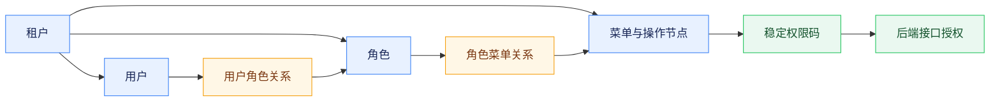
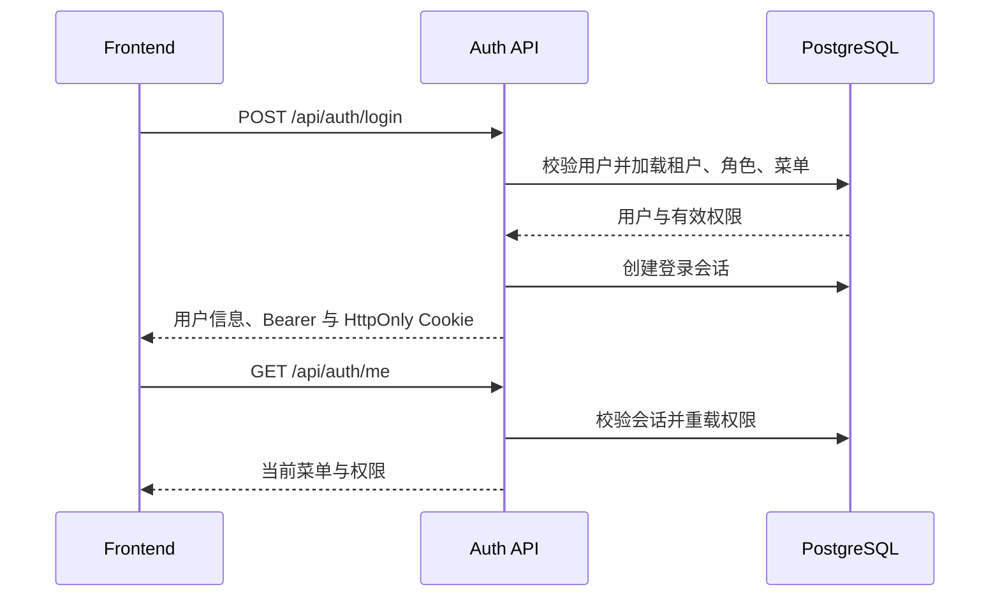

# 多租户账号与权限体系

## 设计目标

job-buddy 使用“租户、用户、角色、菜单、权限”组成的动态 RBAC 模型。租户是服务端数据隔离边界，但不作为普通用户的登录输入；用户使用全局唯一用户名和密码登录，后端从用户记录解析租户。授权判断以数据库中的角色和菜单关系为准，不依赖写死的 `admin` 或 `user` 角色名称。

规范基线创建共享租户、权限、角色、菜单目录，并通过受控身份种子迁移创建 `admin` 管理员和 `user` 普通用户及其角色关联。两个账号使用固定初始密码 `12345678`，Flyway 只保存 BCrypt 哈希，不创建会话或外部凭据；开发环境保留该首次登录能力，`JOB_BUDDY_ENVIRONMENT=prod` 或 `production` 时 Backend 启动会校验两个启用账号并拒绝未轮换的默认密码，同时拒绝 `JOB_BUDDY_AUTH_ENABLED=false`。已发布迁移保持不可变，密码仍通过用户管理能力重置。除该受控身份种子及其后续状态维护迁移外，其他用户及用户私有业务数据不得写入 Flyway。

## 数据模型与授权

`app_user` 保存用户及租户归属，`rbac_role` 保存租户内角色，`rbac_menu` 保存导航菜单和不参与导航的功能权限节点，`user_role` 与 `role_menu` 建立多对多关系，`permission_definition` 保存后端认可的稳定权限码。用户的有效菜单是其全部启用角色所授权、同时启用且可见的导航菜单并集；有效权限是导航菜单和功能权限节点所关联权限码的去重集合。管理界面必须把 `action` 类型呈现为“功能权限”，不能把 Boss 直聘等能力误称为菜单。

菜单可以引用 `permission_definition` 中已有的权限码，但不能通过数据库配置创造新的后端执行能力。所有 `/api/**` 端点先经过身份认证；管理能力和平台能力再由 `@RequirePermission` 与 `ApiAuthorizationInterceptor` 执行显式授权，使用 `users:manage`、`roles:manage`、`menus:manage`、`tenant:manage` 和不可委派的 `platform:manage` 等权限码。用户自有的会话、分析任务和工作区接口以认证身份加“租户 + 用户 + 资源”所有权作为授权边界，不伪装成管理权限。前端菜单隐藏和路由守卫只改善体验，不能替代服务端校验。

## 登录与会话

`POST /api/auth/login` 接收用户名和密码。认证成功后，后端创建数据库会话并签发随机令牌，同时返回用户、租户、角色、权限和有序菜单。浏览器通过 HttpOnly Cookie 恢复跨标签和重启后的登录态；前端仍可在当前标签页使用 Bearer 令牌。`GET /api/auth/me` 是恢复身份和权限的权威接口，`POST /api/auth/logout` 注销服务端会话并清除 Cookie。

用户角色、角色菜单、角色或菜单启停发生变化后，服务端清理受影响用户的会话和短期缓存，使权限在重新登录后生效。任何用户、角色、菜单或授权变更都必须保留至少一个具备管理能力的启用用户，防止租户锁死自身。

动态 RBAC 采用权限委派上限。普通操作者只能把自己当前拥有且在权限目录中标记为可委派的能力授予角色或用户；不可委派权限不能由普通租户管理者新增。具备 `platform:manage` 的平台管理员可以显式委派自己拥有的受保护权限，因此可在用户管理中分配管理员角色，但仍不能修改自己的角色，也不能授予自己并不拥有的能力。修改受保护角色、给用户绑定角色、重置密码或替换既有角色时，还必须校验目标账号的有效权限不高于操作者，避免普通管理者接管平台控制主体。角色列表与可分配菜单同样按这一上限过滤，避免前端展示服务端最终会拒绝的目标。

## 管理能力与隔离边界

`/api/admin/users` 管理租户内用户、全局唯一用户名、状态、显示名、密码和角色；编辑用户名时继续由大小写不敏感的全局唯一索引校验，成功后立即失效该用户的既有会话。`/api/admin/rbac/roles` 管理角色的导航菜单与功能权限授权；`/api/admin/rbac/menus` 管理菜单树、功能权限节点、组件键、路由、外链、排序、启停与权限码。被用户引用的角色、含子节点或被角色引用的菜单不能直接删除，菜单不能形成父子循环。

所有管理查询从认证上下文取得 `tenant_id` 和操作者身份，管理员只能维护本租户且位于自身委派上限内的账号与授权元数据，不能因此读取其他用户的简历、聊天、岗位、练习、项目、Boss 凭据或工作区状态。业务资源进一步按“租户 + 用户 + 资源”校验所有权。平台全局设置不是租户资源，只允许不可委派的平台控制主体访问。前端侧边栏使用 `/api/auth/me` 返回的菜单动态渲染，受控 `component_key` 只能映射到构建时注册的 Vue 组件，数据库内容不能注入可执行代码。

## 验证与风险

认证与授权测试应覆盖默认账号及角色关联、默认普通角色最小权限、默认密码登录、创建与编辑时的全局用户名唯一性、多角色权限并集、动态菜单、导航菜单与功能权限的区分、平台管理员角色委派、普通管理者委派上限、受保护账号密码重置、权限变化后的会话失效、菜单循环和引用保护、最后管理账号保护、跨租户隔离、登录失败预算及无权限接口拒绝。前端需验证登录恢复、动态侧边栏、用户/角色/菜单管理和无权限路由。公开部署必须启用 HTTPS、安全 Cookie、强密码策略、登录失败预算和审计，并在首次登录后立即轮换默认密码；RBAC 只解决授权，不替代 CSRF、限流和凭据轮换。
